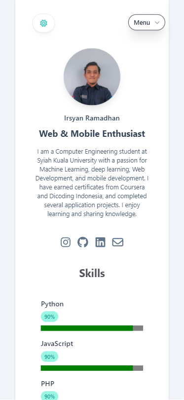
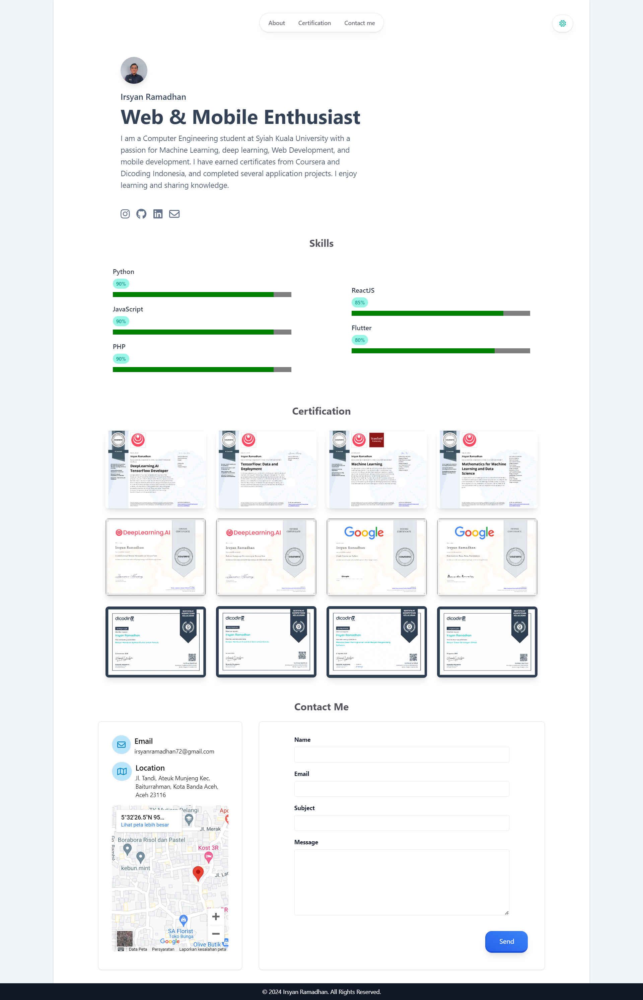
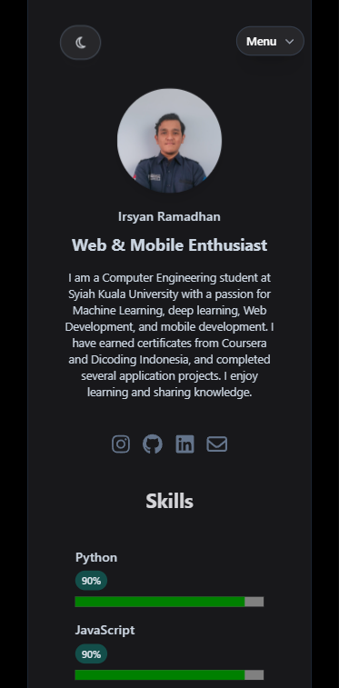
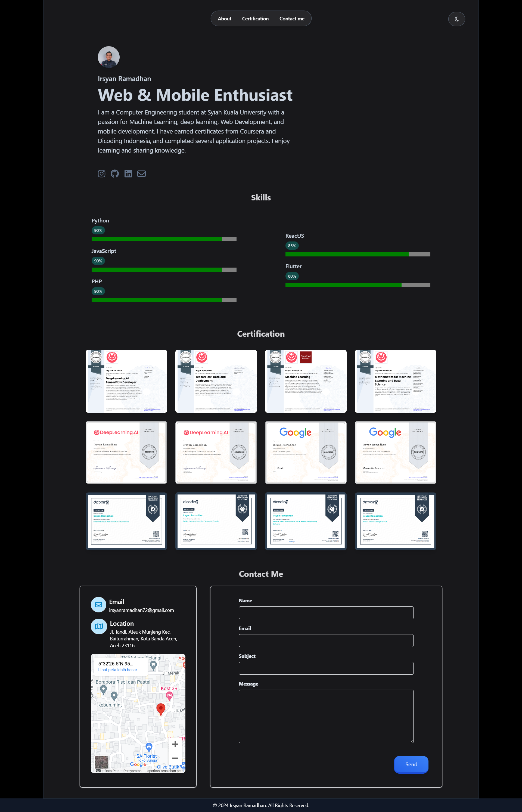

# Irsyan Ramadhan Portfolio

Welcome to my personal portfolio website, built using React, Vite, and Tailwind CSS. This site showcases my skills, certifications, and ways to get in touch with me.


## 🌟 Features

- **Single Page Application (SPA)**: Smooth navigation between sections without reloading.
- **Responsive Design**: Optimized for all devices, ensuring a seamless experience on both desktop and mobile.
- **Dark Mode & Light Mode**: Toggle between themes for a better viewing experience.
- **Three Sections**:
  - **About**: A brief introduction about myself.
  - **Certification**: A list of my professional certifications.
  - **Contact Me**: A form to get in touch with me.

## 🚀 Tech Stack

- **React**: A JavaScript library for building user interfaces.
- **Vite**: Next Generation Frontend Tooling for faster development.
- **Tailwind CSS**: A utility-first CSS framework for rapid UI development.

## 🔧 Getting Started

To get a local copy up and running, follow these simple steps.

### Prerequisites

Ensure you have Node.js and npm installed on your machine.

### Installation

1. **Clone the repo**
    ```sh
    git clone https://github.com/Irsyan12/porto-react.git
    ```
2. **Navigate to the project directory**
    ```sh
    cd porto-react
    ```
3. **Install NPM packages**
    ```sh
    npm install
    ```

### Usage

1. **Run the development server**
    ```sh
    npm run dev
    ```
2. **Open your browser and visit**
    ```
    http://localhost:3000
    ```

## 📸 Screenshots

### Light Mode
<div style="display: flex;">
  
  
</div>

### Dark Mode
<div style="display: flex;">
  
  
</div>

## 🌐 Live Demo

Check out the live demo [here](https://irsyanrmdhn.netlify.app).

## 🤝 Contributing

Contributions are what make the open-source community such an amazing place to learn, inspire, and create. Any contributions you make are **greatly appreciated**.

1. Fork the Project
2. Create your Feature Branch (`git checkout -b feature/AmazingFeature`)
3. Commit your Changes (`git commit -m 'Add some AmazingFeature'`)
4. Push to the Branch (`git push origin feature/AmazingFeature`)
5. Open a Pull Request

## 📝 License

Distributed under the MIT License. See `LICENSE` for more information.

## 📬 Contact

Irsyan Ramadhan - [irsan.rmd_](https://instagram.com/irsan.rmd_) - irsyanramadhan72@gmail.com

Project Link: [https://github.com/Irsyan12/porto-react.git]([https://github.com/Irsyan12/porto-react.git](https://github.com/Irsyan12/porto-react/edit/master/README.md))

---

Made with ❤️ by Irsyan Ramadhan
